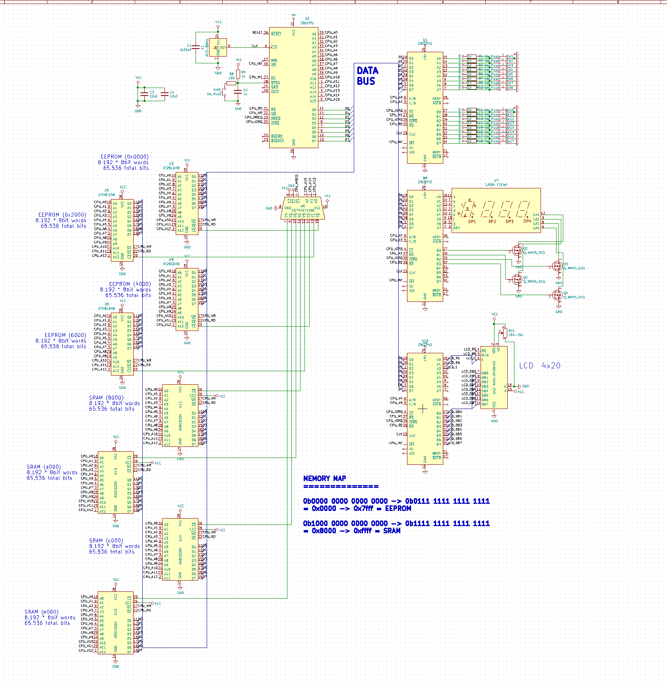

# My computer

## A Z80 computer that I've designed, but haven't made in real life yet

Here's the schematic:

The schematic shows 3 PIO chips to control various peripherals. In practice, I could add up to 5 more PIO chips, but since when I do implement this on a breadboard I will be able to place new components in easily, I left any extra PIO chips out of the schematic.

There are 4 EEPROM chips and 4 static RAM chips for a total of 512Kbits (64KB) of total memory. The various memory chips are enabled using a demultiplexer.

The output screen will be a 4x20 LCD display, alongside a 4-digit 7-segment display, but hobbytronics sells a really nice [VGA driver board](http://www.hobbytronics.co.uk/serial-vga) which I'm tempted to buy.

I haven't written any software for the processor yet.
